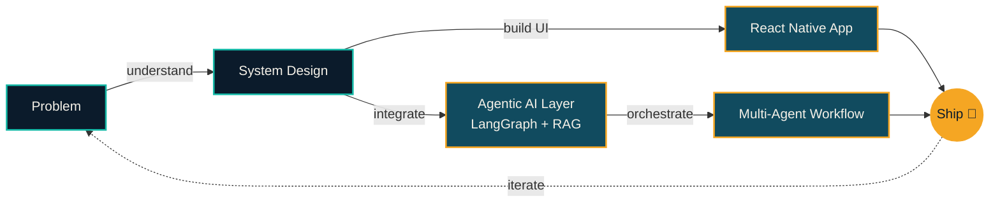

 

 

 

## Impact at a Glance

 

## About

I'm a **B.Tech Computer Science & Engineering student, React Native developer, and Agentic AI developer**, currently studying at Seth Jai Prakash Mukand Lal Institute of Engineering & Technology, Radaur (since 08/2023). I build full products, not just features — the mobile app, the backend it talks to, and increasingly, the AI layer that makes it smart.

My primary focus is **React Native application development**: performant, maintainable, cross-platform apps backed by real APIs, cloud infrastructure, and databases. Alongside that, I build **Agentic AI systems** — LangChain / LangGraph pipelines, Retrieval-Augmented Generation, Model Context Protocol (MCP) tooling, and multi-agent workflows — and wire the two together so intelligence isn't bolted on, it's part of the product.

Over the past year that's meant shipping a real-time messaging app to production, architecting an agentic RAG backend over political data, leading a student tech community, and representing GeeksforGeeks on campus — all while treating every internship, hackathon, and side project as a chance to close the gap between "I can build a feature" and "I can ship a system."

> *"Understand the problem, design the system, build the experience, integrate intelligence, ship, iterate — repeat."*

**Recognized at:**
  

 

## Core Competencies

| Domain | Level | |
|---|---|---|
| **AI & LLMs** — Agentic AI, Prompt Engineering, OpenAI, Gemini, Ollama | Intermediate | ▰▰▰▱▱ |
| **AI Orchestration** — LangChain, LangGraph, stateful agent workflows | Intermediate | ▰▰▰▱▱ |
| **Agents & Protocols** — Multi-Agent Systems, MCP, FastMCP | Intermediate | ▰▰▰▱▱ |
| **Mobile Engineering** — React Native, Expo, Redux Toolkit | Advanced | ▰▰▰▰▱ |
| **AI Application Dev** — LLM-powered app architecture & integration | Intermediate | ▰▰▰▱▱ |

 

## Tech Stack

<table align="center">
<tr>
<td align="center" width="140"><b>Languages</b></td>
<td></td>
</tr>
<tr>
<td align="center"><b>Mobile</b></td>
<td> &nbsp;  </td>
</tr>
<tr>
<td align="center"><b>Frontend</b></td>
<td></td>
</tr>
<tr>
<td align="center"><b>Backend & Data</b></td>
<td></td>
</tr>
<tr>
<td align="center"><b>Agentic AI</b></td>
<td>     </td>
</tr>
<tr>
<td align="center"><b>Cloud & DevOps</b></td>
<td></td>
</tr>
</table>

 

## How I Build

*the same loop runs on every project I ship — including this README.*

 

## Experience

### 🤖 Agentic AI Developer Intern — Codenoids

- Engineered an autonomous Agentic AI backend (Python, LangChain, LangGraph) to process, verify, and analyze complex political data — historical actions and public statements
- Deployed a Retrieval-Augmented Generation (RAG) pipeline using Ollama and vector embeddings, integrated with mobile workflows for real-time, context-aware responses

`Python` `LangChain` `LangGraph` `RAG` `Ollama` `Vector Search`

### 📱 React Native Developer Intern — AppTechies

- Architected real-time messaging infrastructure for the **TapGo** app, enabling scalable one-to-one and group communication pipelines
- Implemented centralized state management and push notifications (Redux Toolkit + Firebase Cloud Messaging) for reliable, low-latency delivery and live presence tracking

`React Native` `JavaScript` `Redux Toolkit` `Firebase FCM`

### 🚀 Founder — CampusXcelerate

- Founded and lead a student-led technical community — workshops, hackathons, and networking with partner communities to grow technical learning

### 🌐 Community Manager — Elite Coders

- Managed community engagement and technical initiatives across LinkedIn, WhatsApp, and Discord — collaboration, knowledge sharing, member participation

### 🧑‍💻 Campus Mantri — GeeksforGeeks

- Represent GeeksforGeeks on campus — coding workshops, hackathons, and technical events promoting competitive programming

 

## Projects

> ### ⭐ Featured — Politician Roaster App
> **AI Political Intelligence Platform** ·  
>
> An AI-powered political intelligence platform for evidence-based analysis of politicians — manifesto summarization, promise tracking, promise-vs-delivery analysis, speech analysis, election history, and politician comparisons, backed by an agentic RAG pipeline over structured political data.
>
> `React Native` `Python` `FastAPI` `LangChain` `LangGraph` `Ollama` `RAG` `ChromaDB` `PostgreSQL`

---

### 💬 TapGo — Real-Time Messaging App
 

Responsive cross-platform chat app with dynamic rendering, secure media sharing, and instant read receipts on Android and iOS. Offline-first — local data persistence via AsyncStorage keeps chat history accessible through network drops.

`React Native` `JavaScript` `Redux Toolkit` `Firebase` `AsyncStorage`

---

### 🔖 Catalogic — Collaborative Bookmark Platform
 

Bookmark management platform for organizing and retrieving web resources through annotations, full-text search, PDFs, and webpage screenshots — with AI-powered tagging, role-based collaboration permissions, and browser extensions for a scalable knowledge-management workflow.

`React` `JavaScript` `Web Archiving` `Local AI`

---

### 🚗 Predictive Parking Marketplace

AI-powered parking platform that predicts parking availability and helps users discover trusted parking spots. It combines location-based discovery with AR-assisted navigation, making it easier to find and reach available parking efficiently

`React Native` `Firebase Firestore` `Cloud Functions` `Google Maps` `ARCore / ARKit`

---

### 🚦 ATOS-X — Smart Traffic Management Platform

AI-powered smart traffic management platform designed to improve urban mobility and reduce traffic congestion. It analyzes traffic data to support smarter monitoring, incident awareness, and data-driven transportation management.

`React Native` `Python AI Engine` `Firebase` `Node.js`

 

## Achievements

| | |
|---|---|
| 🏆 | **Top 100 Contributor (ECSOC)** & active open-source contributor across ECSOC, GSSoC, SSCoC, and NSoC |
| 🥈 | **Top 100 Finalist**, out of **1,000+ teams** — Escape Da Vinci Hackathon, CGC University Mohali |
| 🥈 | **Finalist** — HaXplore Hackathon, IIT (BHU) |
| 🚀 | **Internal Round Qualifier** — Smart India Hackathon 2024 & 2025 |

 

## Certifications

**Virtual Experience:** Advanced Software Engineering Job Simulation — Walmart (via Forage) · Software Engineering Job Simulation — Commonwealth Bank (via Forage)

 

## Coding Profiles

 

## GitHub Insights

 

 

 

 

 

## Currently

| 📚 Learning | 🏗️ Building | 🔭 Exploring | 💼 Open to |
|---|---|---|---|
| Data Structures & Algorithms · Advanced Agentic AI | Politician Roaster App · React Native apps | Multi-Agent Systems · MCP & LLM infrastructure | Software Engineering · AI Engineering roles |

 

## Contact

Thanks for scrolling the way down — now go build something. 🚀

